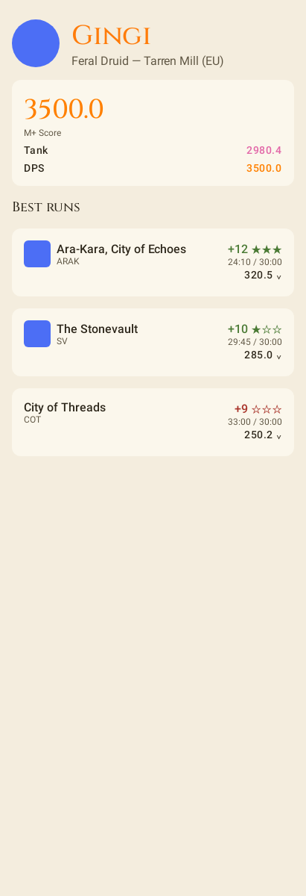
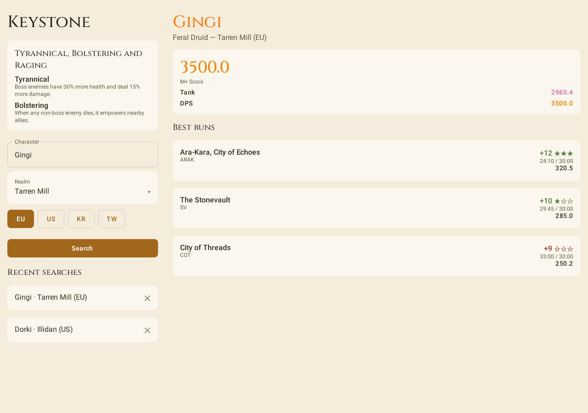

# Keystone

[](https://github.com/marioponceg/Keystone/actions/workflows/ci.yml)
[](https://codecov.io/gh/marioponceg/Keystone)
[](LICENSE)

A WoW Mythic+ companion for Android — search a character, see their season score and best
dungeon runs, and check the weekly affixes. Keystone is the portfolio capstone: it's the
consumer app for the author's three published libraries, all on Maven Central under
`io.github.marioponceg` at `0.1.0`:

- [Conduit](https://github.com/marioponceg/Conduit) — coroutine-first networking, used via
  `conduit-core` / `conduit-engine-okhttp` / `conduit-serialization-kotlinx` for the Raider.IO
  client.
- [Quill](https://github.com/marioponceg/Quill) — structured logging, used via `quill-android`
  (`LogcatSink`, configured in `KeystoneApplication`) and `quill-conduit` (`QuillInterceptor` on
  the HTTP client, logging every request/response as a structured event).
- [Foundry](https://github.com/marioponceg/Foundry) — the Compose design system, used via
  `foundry-components` for every piece of UI in the app.

Data comes from the public, auth-free [Raider.IO](https://raider.io) API. No backend, no login,
no analytics.

## Features

- **Character search** — character name plus a searchable realm picker backed by a bundled
  per-region realm list (no network round-trip to resolve a realm), with region chips and the
  last-used region persisted across launches.
- **Mythic+ profile** — the character's avatar, season score (colored to match the official
  Raider.IO score bands) with a per-role breakdown, and best runs per dungeon with upgrade stars,
  clear times and class-colored character names.
- **Weekly affixes** — a card on the home screen showing the current M+ affix rotation, in the
  device's language where Raider.IO translates it (English otherwise).
- **Recent searches** — the last 10 lookups, deduplicated, saved only after a successful
  profile load (so a typo never pollutes the list), with per-item delete.
- **Adaptive layout** — a two-pane list-detail layout at expanded width (tablet landscape,
  desktop, ChromeOS), a two-column home at medium width, a pane split that aligns to a foldable's
  hinge, and a tabletop layout for character detail on half-open foldables.
- **Keyboard and pointer** — Enter submits a search, Esc closes the realm picker, the realm list
  is navigable with arrow keys, and recent-search rows respond to hover.
- **Run detail on tap** — every best-run card carries its dungeon icon, and tapping one expands it
  in place to show the affixes it was played under and the date it was completed.
- **Open a run on Raider.IO** — the expanded card links out to the run's own page in a themed
  Custom Tab.

## Architecture

Three modules, clean-architecture layering:

```
┌─────────────────────────────────────────────────────────────────┐
│ app  (com.android.application)                                  │
│  Compose UI (Foundry) · ViewModels (MVVM/UDF) · Navigation3     │
│  Hilt DI · Quill setup (LogcatSink, QuillInterceptor)           │
│  DataStore impl of RecentSearchesRepository/RegionPreference    │
│  Adaptive layout (window size class, SceneStrategy, hinges)     │
└────────────────────────────┬────────────────────────────────────┘
                             │ depends on
                             ▼
┌─────────────────────────────────────────────────────────────────┐
│ core-data  (pure Kotlin/JVM)                                    │
│  RaiderIoApi (Conduit client facade) · DTOs + mappers           │
│  Repo impls (remote) · bundled per-region realm snapshots       │
└────────────────────────────┬────────────────────────────────────┘
                             │ depends on
                             ▼
┌─────────────────────────────────────────────────────────────────┐
│ core-domain  (pure Kotlin/JVM)                                  │
│  Models · KeystoneResult / KeystoneError · 8 use cases          │
│  5 repository contracts — no Android, no third-party runtime    │
└─────────────────────────────────────────────────────────────────┘
```

`core-domain` and `core-data` are pure Kotlin/JVM modules (possible for `core-data` because
Conduit itself is JVM-pure), kept Android-free with a future KMP/iOS migration in mind. `app` is
the only module that touches Android — Compose, Hilt, Navigation3, the adaptive layout logic and
the DataStore-backed repo implementations all live there.

Screens follow MVVM with strict unidirectional data flow: one immutable `UiState` per screen
exposed as `StateFlow`, user events as a sealed interface, one-shot effects kept separate from
state. Every `UiState` variant feeds both a Compose `@Preview` (via `PreviewParameterProvider`)
and a Roborazzi screenshot test, light and dark.

## Screenshots

| Home | Character detail | Two panes (expanded) |
|---|---|---|
|  |  |  |

## Tech stack

- Kotlin 2.2, AGP 9.2 with built-in Kotlin (no `kotlin-android` plugin); JVM toolchain 21 on the
  pure-Kotlin/JVM modules (`core-domain`, `core-data`), Java 17 source/target on `app`
- Jetpack Compose (BOM 2026.06) with the Foundry design system
- Navigation3, Hilt, DataStore Preferences, kotlinx.serialization
- Adaptive UI via Navigation3 `SceneStrategy` (`material3.adaptive:adaptive-navigation3`) — note
  this artifact has no stable release yet, so its version is pinned explicitly rather than taken
  from the Compose BOM
- Conduit (networking) + Quill (logging) — see above
- JUnit 5 for the pure-Kotlin modules, coroutines-test + Turbine for ViewModels, Robolectric +
  Roborazzi for screenshot tests
- detekt (zero tolerance for unresolved issues) + Kover (90% minimum line coverage on
  `core-domain` / `core-data`)

## Building

```sh
./gradlew build detekt koverVerify verifyRoborazziDebug
```

- `build` compiles everything and runs all unit tests + Android Lint.
- `detekt` runs static analysis and formatting checks (ktlint rules via detekt-formatting).
- `koverVerify` enforces the 90% minimum coverage rule on the two pure-Kotlin modules.
- `verifyRoborazziDebug` checks screenshot tests against the committed goldens in
  `app/src/test/screenshots/`.

CI runs the same four commands on every pull request.

### Refreshing the realm list

Realm snapshots in `core-data/src/main/resources/realms/` are generated once from Raider.IO's
realm listing (they change ~yearly). To refresh:

    python3 scripts/generate-realms.py

No credentials are needed. The script uses an undocumented Raider.IO endpoint at generation
time only — the app itself calls only Raider.IO's documented v1 API.

## Roadmap

Future versions, not in scope for v0.4:

- Crashlytics, including a `QuillSink` that forwards Quill events to it
- Battle.net OAuth and the official Blizzard API, replacing the auth-free Raider.IO endpoints

### On iOS

`core-domain` is already free of JVM-specific APIs and would convert to a Kotlin Multiplatform
module cheaply. The blocker is not this repository: `core-data` depends on Conduit, which ships
JVM-only with an OkHttp engine, and the `app` module would need Compose Multiplatform, which in
turn needs a CMP build of Foundry and a KMP build of Quill. The order of work is therefore
Conduit KMP → Quill KMP → Foundry CMP → Keystone iOS, and the first three do not live here.

## Design notes

Keystone is a portfolio project built with senior-engineering discipline: every design unit
landed as a reviewed PR with tests first, 90% minimum line coverage enforced in CI, screenshot
tests for every visual state, and the reasoning behind each decision recorded in
[AGENTS.md](AGENTS.md).

## License

[Apache 2.0](LICENSE)
